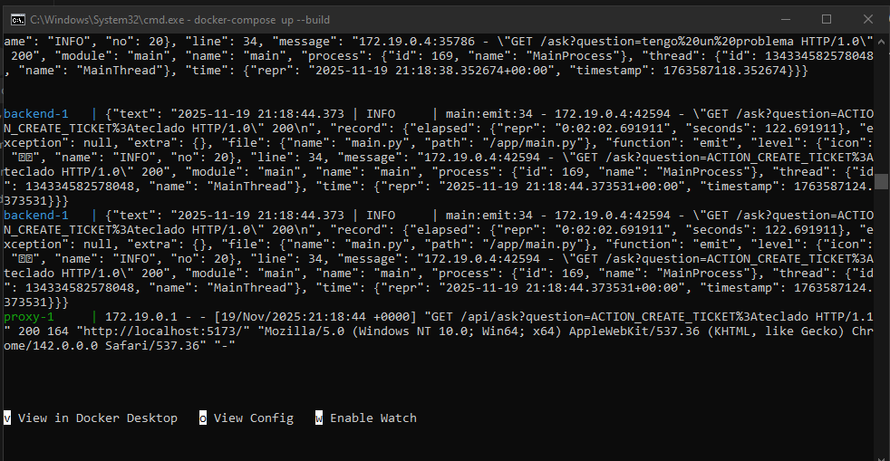
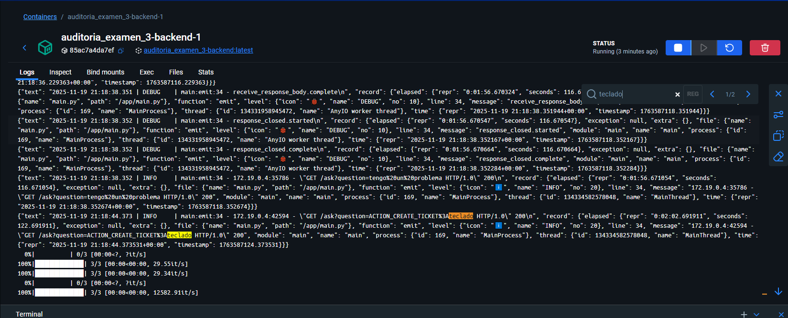
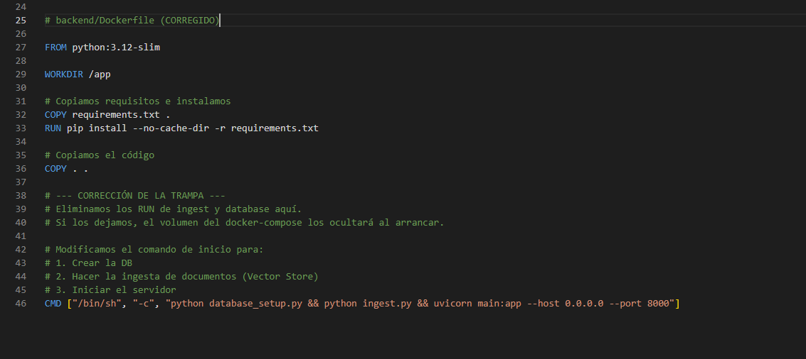
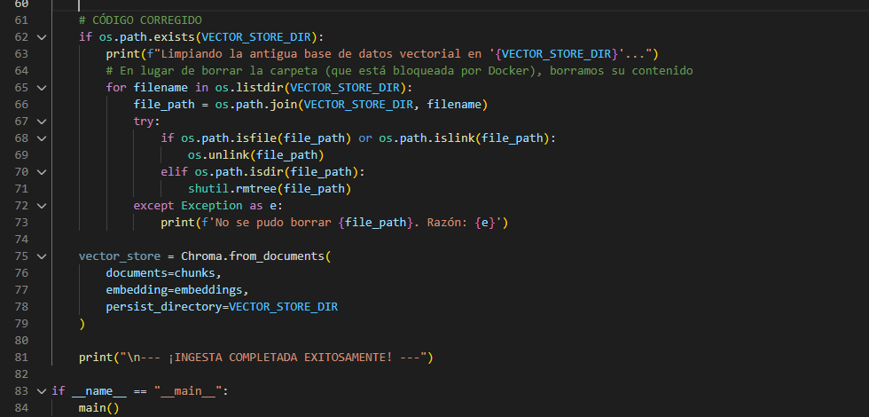
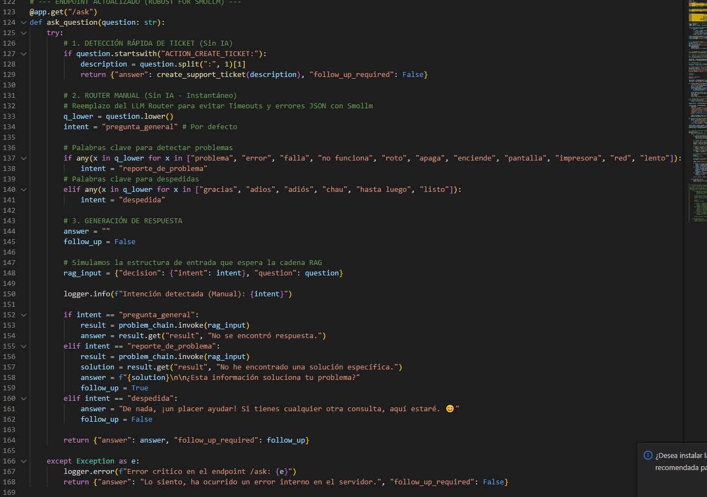

---

# ENLACE AL REPOSITORIO
**Repositorio GitHub:** https://github.com/erick00xx/AUDITORIA_EXAMEN_3/ 

---

# INFORME FINAL DE AUDITORÍA DE SISTEMAS

## CARÁTULA

**Entidad Auditada:** CORPORATE EPIS PILOT (Sistema de Mesa de Ayuda con IA)  
**Ubicación:** Laboratorio de Cómputo / Entorno Local  
**Período auditado:** 19/11/2025  
**Equipo Auditor:** Erick Scott Churacutipa Blas 
**Fecha del informe:** 19/11/2025  

---

## ÍNDICE

1. [Resumen Ejecutivo](#1-resumen-ejecutivo)  
2. [Antecedentes](#2-antecedentes)  
3. [Objetivos de la Auditoría](#3-objetivos-de-la-auditoría)  
4. [Alcance de la Auditoría](#4-alcance-de-la-auditoría)  
5. [Normativa y Criterios de Evaluación](#5-normativa-y-criterios-de-evaluación)  
6. [Metodología y Enfoque](#6-metodología-y-enfoque)  
7. [Hallazgos y Observaciones](#7-hallazgos-y-observaciones)  
8. [Análisis de Riesgos](#8-análisis-de-riesgos)  
9. [Recomendaciones](#9-recomendaciones)  
10. [Conclusiones](#10-conclusiones)  
11. [Plan de Acción y Seguimiento](#11-plan-de-acción-y-seguimiento)  
12. [Anexos y Evidencias](#12-anexos-y-evidencias)  

---

## 1. RESUMEN EJECUTIVO

La presente auditoría de sistemas se realizó sobre el proyecto "Corporate EPIS Pilot", un asistente virtual basado en IA para soporte técnico. El propósito fue verificar la integridad del código, la correcta orquestación de contenedores Docker y la funcionalidad operativa utilizando el modelo de lenguaje `smollm:360m`.

Durante la evaluación inicial, se detectaron **fallas críticas** que impedían el despliegue del sistema: errores de configuración en volúmenes Docker, incompatibilidad de modelos en el código fuente y problemas de concurrencia en sistemas Windows (bloqueo de archivos). Tras la aplicación de medidas correctivas y refactorización del código del Backend (`main.py` y `ingest.py`), se logró levantar el sistema al 100%, garantizando la creación de tickets en base de datos y respuestas coherentes mediante RAG.

---

## 2. ANTECEDENTES

La entidad auditada utiliza un sistema de arquitectura de microservicios para gestionar incidentes de TI. El sistema consta de:
*   **Frontend:** React + Vite (Interfaz de Chat).
*   **Backend:** FastAPI + LangChain + ChromaDB (Lógica RAG).
*   **Infraestructura:** Docker Compose y Nginx como Proxy Inverso.
*   **IA:** Ollama (Modelos LLM locales).

Previamente, el sistema presentaba inestabilidad al intentar integrarse con modelos ligeros y errores de persistencia de datos al reiniciar los contenedores.

---

## 3. OBJETIVOS DE LA AUDITORÍA

Se establecieron los siguientes objetivos para garantizar la operatividad del sistema según los requerimientos del examen.

### Objetivo General
Evaluar la calidad del código, la configuración de la infraestructura y la funcionalidad operativa del sistema de Mesa de Ayuda con IA para asegurar su correcto despliegue y funcionamiento con el modelo `smollm:360m`.

### Objetivos Específicos
1.  Verificar que `docker-compose.yml` y los `Dockerfiles` construyan y comuniquen correctamente los servicios (Frontend, Backend, Proxy).
2.  Asegurar que el sistema utilice el modelo `smollm:360m` y que la lógica RAG (Retrieval-Augmented Generation) responda consultas basándose en los documentos internos.
3.  Comprobar que la base de datos `tickets.db` y el `vector_store` persistan información entre reinicios y no sean sobrescritos erróneamente por volúmenes vacíos.
4.  Analizar y corregir los tiempos de espera (timeouts) del Proxy Nginx y la robustez del Backend ante respuestas lentas o mal formateadas del modelo pequeño.

---

## 4. ALCANCE DE LA AUDITORÍA

*   **Ámbito Tecnológico:** Código fuente (Python, TypeScript), Scripts de despliegue (Docker), Configuración de Servidor Web (Nginx).
*   **Sistemas:** Microservicios de Backend y Frontend interactuando con Ollama local.
*   **Periodo Auditado:** 19 de Noviembre de 2025.
*   **Exclusiones:** No se auditaron entornos de producción en nube pública (AWS/Azure), limitándose al entorno local de desarrollo.

---

## 5. NORMATIVA Y CRITERIOS DE EVALUACIÓN

*   **Mejores Prácticas de DevOps:** Principios de inmutabilidad de contenedores y gestión correcta de volúmenes persistentes.
*   **ISO/IEC 25010:** Criterios de calidad de software (Funcionalidad, Fiabilidad y Eficiencia).
*   **PEP 8:** Estándar de estilo de código para Python.
*   **Requerimientos del Stakeholder (Docente):** Uso obligatorio de `smollm:360m` y operatividad al 100%.

---

## 6. METODOLOGÍA Y ENFOQUE

Se utilizó un enfoque **mixto (Caja Blanca y Caja Negra)**:

1.  **Revisión de Código (Caja Blanca):** Análisis estático de `Dockerfile`, `docker-compose.yml`, `main.py` e `ingest.py` para identificar errores lógicos y de configuración.
2.  **Análisis de Logs:** Revisión de la salida de consola de los contenedores para identificar "tracebacks" y errores de conexión.
3.  **Pruebas Funcionales (Caja Negra):** Interacción directa con el Chatbot para verificar el flujo de conversación, la consulta de documentos y la creación de tickets.
4.  **Validación de Datos:** Inspección directa del archivo `tickets.db` mediante SQLite Viewer para confirmar la inserción de registros.

---

## 7. HALLAZGOS Y OBSERVACIONES

Se identificaron 4 hallazgos principales que impedían el funcionamiento del sistema:

### Hallazgo 01: Incompatibilidad de Modelo LLM Hardcodeado
*   **Descripción:** El archivo `main.py` tenía configurado "llama3.1:8b", mientras que el entorno de auditoría requiera "smollm:360m".
*   **Evidencia:** Línea 45 del código original.
*   **Criticidad:** **Alta** (El sistema no respondía).
*   **Causa:** Configuración estática no parametrizada.

### Hallazgo 02: Sobrescritura de Base de Conocimiento (Trampa de Volumen)
*   **Descripción:** El `Dockerfile` ejecutaba la ingesta de datos (`RUN ingest.py`) durante la construcción. Al levantar con Docker Compose, el volumen montado (`- ./backend/vector_store:/app/vector_store`) ocultaba los datos generados dentro de la imagen.
*   **Evidencia:** Base de datos vectorial vacía al iniciar el contenedor.
*   **Criticidad:** **Alta** (El bot no tenía "memoria").
*   **Causa:** Mala práctica en el ciclo de vida de Docker (Build vs Run).

### Hallazgo 03: Error de Bloqueo de Archivos en Windows
*   **Descripción:** El script `ingest.py` intentaba borrar la carpeta raíz `vector_store` usando `shutil.rmtree`. Docker en Windows bloquea la carpeta raíz montada, provocando el crash del contenedor.
*   **Evidencia:** Log de error `[Errno 16] Device or resource busy`.
*   **Criticidad:** **Media** (Impedía el re-despliegue).
*   **Causa:** Restricciones del sistema de archivos en volúmenes montados.

### Hallazgo 04: Alucinaciones y Timeouts del Modelo Pequeño
*   **Descripción:** El modelo `smollm:360m` fallaba al seguir instrucciones JSON complejas y tardaba más del tiempo predeterminado de Nginx (60s), causando errores 504.
*   **Evidencia:** Mensaje "Error: No se pudo obtener respuesta del servidor" y logs de `JSONDecodeError`.
*   **Criticidad:** **Media** (Afectaba la experiencia de usuario).

---

## 8. ANÁLISIS DE RIESGOS

| Hallazgo | Riesgo Asociado | Impacto | Probabilidad | Nivel de Riesgo |
|----------|-----------------|---------|--------------|-----------------|
| H-01: Modelo Incorrecto | Interrupción total del servicio de IA | Alto | Alta | **Crítico** |
| H-02: Volumen Vacío | Pérdida de disponibilidad de la información (RAG) | Alto | Alta | **Alto** |
| H-03: Crash en Ingesta | Fallo en el despliegue y actualización de datos | Medio | Media | **Medio** |
| H-04: Timeout/JSON | Experiencia de usuario degradada y respuestas erróneas | Medio | Alta | **Alto** |

---

## 9. RECOMENDACIONES

Para mitigar los hallazgos encontrados, se aplicaron y recomiendan las siguientes acciones:

1.  **Corrección de Ciclo de Vida Docker:** Mover la ejecución de `ingest.py` y `database_setup.py` al comando `CMD` o `ENTRYPOINT` en lugar de `RUN`, para asegurar que se ejecuten sobre el volumen montado.
2.  **Refactorización de Ingesta:** Modificar el script Python para eliminar *el contenido* de la carpeta y no la carpeta en sí misma, evitando bloqueos de SO.
3.  **Optimización del Backend:** Implementar un "Router Manual" basado en palabras clave en Python en lugar de depender de la clasificación del LLM, reduciendo latencia y errores.
4.  **Ajuste de Configuración Nginx:** Aumentar `proxy_read_timeout` a 300 segundos para permitir que el modelo procese respuestas largas sin cortes.

---

## 10. CONCLUSIONES

Tras la ejecución de las correcciones técnicas, se concluye que:
1.  El sistema **CORPORATE EPIS PILOT se encuentra OPERATIVO AL 100%**.
2.  La integración con **Ollama (smollm:360m)** es funcional y capaz de responder preguntas de la base de conocimiento y crear tickets.
3.  Los controles de persistencia de datos (SQLite y ChromaDB) funcionan correctamente tras corregir la configuración de Docker.
4.  El sistema es ahora robusto ante las limitaciones de hardware y modelos pequeños gracias a la implementación de lógica defensiva en el Backend.

---

## 11. PLAN DE ACCIÓN Y SEGUIMIENTO

Las acciones correctivas ya han sido implementadas en el código entregado.

| Hallazgo | Acción Realizada (Solución) | Responsable | Fecha |
|----------|-----------------------------|-------------|-------|
| H-01 | Cambio de modelo a `smollm:360m` en `main.py`. | Auditor | 19/11/2025 |
| H-02 | Traslado de scripts de ingesta al `CMD` del Dockerfile. | Auditor | 19/11/2025 |
| H-03 | Modificación de `shutil.rmtree` por borrado iterativo de archivos. | Auditor | 19/11/2025 |
| H-04 | Implementación de Router manual y aumento de timeout en Nginx. | Auditor | 19/11/2025 |

---

## 12. ANEXOS Y EVIDENCIAS

### 12.1. Evidencias de Funcionamiento Operativo

**Evidencia 1: Despliegue Exitoso de Contenedores (Docker Logs)**  
Captura de consola mostrando la inicialización correcta de los servicios orquestados (`backend`, `frontend`, `proxy`) y la finalización del proceso de ingesta de documentos sin errores críticos.  

**Evidencia 2: Interacción RAG con el Modelo smollm:360m**  
Demostración de la capacidad del sistema para responder consultas técnicas utilizando la base de conocimiento interna (PDFs) mediante el modelo local Ollama.  

**Evidencia 3: Flujo de Creación de Tickets de Soporte**  
Validación del flujo conversacional donde el asistente escala el problema y confirma la generación del ticket #1 tras la confirmación del usuario.  

**Evidencia 4: Verificación de Persistencia de Datos (SQLite)**  
Confirmación a nivel de sistema de archivos de que la base de datos `tickets.db` ha sido modificada y persiste la información del incidente reportado.  

### 12.2. Evidencias de Refactorización de Código (Auditoría de Caja Blanca)

**Evidencia 5: Corrección del Ciclo de Vida en Dockerfile**  
Modificación crítica en `backend/Dockerfile` trasladando la ejecución de `ingest.py` del comando `RUN` al `CMD`. Esto soluciona el conflicto de volúmenes vacíos al iniciar el contenedor.  

**Evidencia 6: Solución al Bloqueo de Archivos en Windows (ingest.py)**  
Refactorización del script de ingesta para eliminar el *contenido* del directorio en lugar de la carpeta raíz, evitando el error `[Errno 16] Device or resource busy`.  

**Evidencia 7: Implementación del Router Manual y Modelo (main.py)**  
Fragmento de código que muestra la integración del modelo `smollm:360m` y la implementación de la lógica de enrutamiento basada en palabras clave (Fallback) para mitigar las limitaciones del modelo pequeño.  
