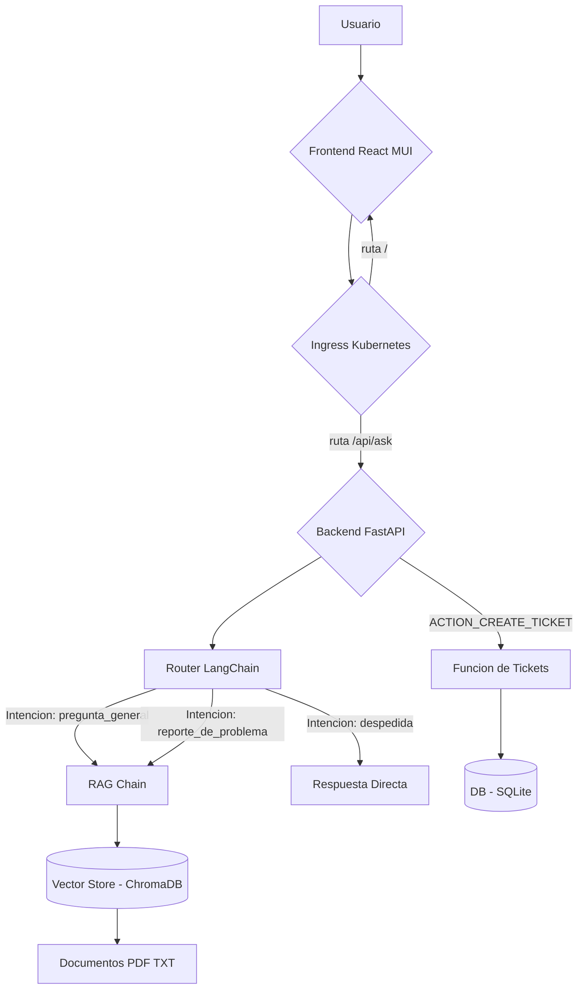

# Corporate EPIS Pilot

Asistente de IA conversacional para entornos empresariales, creado para responder dudas de los usuarios con base en una fuente de conocimiento interna y guiar al usuario a través de un flujo de solución de problemas antes de crear tickets de soporte técnico.

---

## Características Principales

- **Arquitectura RAG (Retrieval-Augmented Generation):** El bot basa su conocimiento en un conjunto de documentos privados (PDFs, TXTs) para garantizar respuestas precisas y reducir alucinaciones.
- **Router de Intenciones:** Un LLM clasifica la intención del usuario (`pregunta general`, `reporte de problema`, `despedida`) para dirigir la conversación de forma inteligente.
- **Flujo de Conversación Guiado:** En lugar de crear un ticket directamente, el bot primero ofrece una solución de la base de conocimiento. Luego, pregunta explícitamente al usuario si el problema se ha solucionado, implementando un **bucle de feedback** efectivo.
- **Creación de Tickets por Acción:** Si la solución no es suficiente, el frontend ofrece al usuario la opción de crear un ticket. Esta decisión se comunica al backend mediante un mensaje de acción especial (`ACTION_CREATE_TICKET`), demostrando un patrón de diseño robusto para agentes de IA.
- **Pila Tecnológica Local y Open-Source:** El sistema funciona 100% localmente usando Ollama con Llama 3.1 y modelos de embeddings de alto rendimiento, sin depender de APIs de pago.
- **Listo para Despliegue (Docker y Kubernetes):** El proyecto está completamente "dockerizado" y cuenta con manifiestos de Kubernetes para su orquestación, demostrando un flujo de trabajo listo para producción.
- **CI/CD Automatizado:** Un workflow de GitHub Actions se encarga de construir y publicar automáticamente las imágenes de Docker en Docker Hub cada vez que se actualiza el código.

---

## Arquitectura del Sistema

La arquitectura consiste en un frontend que gestiona el estado de la conversación y un backend stateless que responde a cada pregunta a través de un único endpoint. La lógica de decisión reside en el router de LangChain.

## Stack Tecnológico

| Área | Tecnologías |
|------|--------------|
| **Backend** | Python, FastAPI, LangChain, Ollama (Llama 3.1), Uvicorn |
| **IA & NLP** | RAG, Hugging Face Embeddings (`multilingual-e5-large`), ChromaDB |
| **Frontend** | React, TypeScript, Material-UI (MUI), Vite |
| **Base de Datos** | SQLite |
| **DevOps** | Docker, Docker Compose, Kubernetes, NGINX Ingress, GitHub Actions |

Al acceder a la interfaz http://localhost:5173 debe interactuar hasta  Registra el Ticket en la Base de Datos, el cual debe ser vericable.

Nota. Para este examen deberán usar smollm:360m en lugar de Llama 3.1